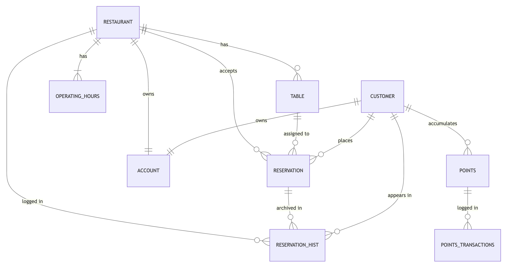

# Design Document

By Kalle Georgiev

Video overview: https://youtu.be/rjeGIXLsBbQ

## Scope

A database to facilitate the booking and management of nationwide (US) restaurant reservations for both diners and restaurants.

Included in the database's scope are:

* Customers, including basic identifying information
* Restaurants, including basic identifying information
* Operating hours, which links each restaurant with their operating days and times (some are closed certain days of the week)
* Rewards points, which includes both a transaction table for debits and credits as well as a table with the current balance for a customer
* App accounts, which can be for a restaurant or a customer
* Tables, which are either booked or available for a restaurant that is signed up to take reservations
* Reservations from customers at restaurants, including the date and time and any special requests or occasion information

Out of scope are elements like restaurant reviews, forms of payment, and other public profile information for account entities.

## Functional Requirements

This database will support:

* CRUD operations for customers and restaurants
* Tracking points balances for customers
* Allowing customer to make multiple reservations at multiple restaurant establishments

## Representation

Entities are captured in SQLite tables with the following schema.

#### Customers

The `customers` table includes:

* `id`, which specifies the unique ID for the customer as an `INTEGER`. This column thus has the `PRIMARY KEY` constraint applied.
* `first_name`, which specifies the customer's first name as `TEXT`, given `TEXT` is appropriate for name fields.
* `last_name`, which specifies the customer's last name. `TEXT` is used as the appropriate field.
* `email`, which specifies the customer's email address. `TEXT` is used as the appropriate field with a `UNIQUE` constraint which ensures that each email in the database is unique.
* `phone`, which specifies the phone number for the customer. Two people could theoretically have the same phone number, so no `UNIQUE` constraint is used. This is stored as `TEXT`.

All fields are required and are indicated with NOT NULL constraints. Email is constrained with UNIQUE.

#### Restaurants

The `restaurants` table includes:

* `id`, which specifies the unique ID for the restaurant as an `INTEGER`. This column thus has the `PRIMARY KEY` constraint applied.
* `name`, `location`, `cuisine`, `phone`, which specifies the self-explanatory details for each restaurant as `TEXT`.

All fields are required and are indicated with NOT NULL constraints.

#### Operating Hours

The `operating_hours` table includes:

* `id`, which specifies a unique ID for the operating hours entry as an `INTEGER`. This column thus has the `PRIMARY KEY` constraint applied.
* `restaurant_id`, which specifies the ID of the restaurant as an `INTEGER`. This column thus has the `FOREIGN KEY` constraint applied, referencing the `id` column in the `restaurants` table, which ensures each `operating_hours` row belongs to a particular restaurant.
* `open_time` and `close_time` specify the restaurant's hours of operation and would be used to indicate if a restaurant is open or not
* `days` would specify which days of the week the restaurant is open for business and is stored as `TEXT`. There is a `CHECK` applied to make sure that the days are valid days of the week.

All fields are required and are indicated with NOT NULL constraints.

#### Tables

The `tables` table includes:

* `id`, which specifies a unique ID for the tables entry as an `INTEGER`. This column thus has the `PRIMARY KEY` constraint applied.
* `restaurant_id`, which specifies the ID of the restaurant as an `INTEGER`. This column thus has the `FOREIGN KEY` constraint applied, referencing the `id` column in the `restaurants` table, which ensures each `table` row belongs to a particular restaurant.
* `reservation_id` which specifies the ID of the reservation as an `INTEGER`. This column thus has the `FOREIGN KEY` constraint applied, referencing the `id` column in the `reservations` table, which ensures each `tables` row belongs to a particular reservation.
* `date`, which specifies the date that the table exists (whether it be available or not), stored as a `DATE`.
* `start_time`, which is the starting time of the table event (whether available or not) stored as `TEXT` in a 24 hour time format like '00:00'. Reservations only normally have a start time, it is not common to have a specific end time to a restaurant reservation. Table turn times are managed by the restaurant staff.
* `available`, which specifies if the table is available or not, stored as an `INTEGER` 0 or 1.

All fields are required and have a NOT NULL constraint. The `available` column has a `CHECK` of 0 or 1.

#### Reservations

The `reservations` table includes:

* `id`, which specifies a unique ID for the reservations entry as an `INTEGER`. This column thus has the `PRIMARY KEY` constraint applied.
* `restaurant_id`, which specifies the ID of the restaurant as an `INTEGER`. This column thus has the `FOREIGN KEY` constraint applied, referencing the `id` column in the `restaurants` table, which ensures each `reservations` row belongs to a particular restaurant.
* `customer_id`, which specifies the ID of the customer as an `INTEGER`. This column thus has the `FOREIGN KEY` constraint applied, referencing the `id` column in the `customers` table, which ensures each `reservations` row belongs to a particular customer.
* `table_id`, which specifies the ID of the customer as an `INTEGER`. This column thus has the `FOREIGN KEY` constraint applied, referencing the `id` column in the `tables` table, which ensures each `reservations` row belongs to a particular customer.
* `guests`, which specifies how many guests will be attending, stored as an `INTEGER`.
* `special_req`, which specifies if there are any special requests for the reservations like dietary restrictions or outdoor preference, stored as `TEXT`.
* `occasion`, which specifies any occasion that the customers are celebrating, like birthdays or anniversaries which would be passed along to the restaurant staff, stored as `TEXT`.
* `date`, which is the date of the reservation, stored as a `DATE`.
* `start_time`, which is the starting time of the reservation stored as `TEXT` in a 24 hour time format like '00:00'. Reservations only normally have a start time, it is not common to have a specific end time to a restaurant reservation. Table turn times are managed by the restaurant staff.

All fields are required and have a NOT NULL constraint except for `special_req` and `occasion` which are optional fields.

#### Points

The `points` table includes:

* `id`, which specifies a unique ID for the points entry as an `INTEGER`. This column thus has the `PRIMARY KEY` constraint applied.
* `customer_id`, which specifies the ID of the customer as an `INTEGER`. This column thus has the `FOREIGN KEY` constraint applied, referencing the `id` column in the `customers` table, which ensures each `points` row belongs to a particular customer.
* `points_balance`, which is the current total balance of the customer's points taking into account any debits or credits stored as an `INTEGER`.

All fields are required and have a NOT NULL constraint. The default for points_balance would be set to 0 by default.

#### Points Transactions

The `points_transactions` table includes:

* `id`, which specifies a unique ID for the points_transactions entry as an `INTEGER`. This column thus has the `PRIMARY KEY` constraint applied.
* `customer_id`, which specifies the ID of the customer as an `INTEGER`. This column thus has the `FOREIGN KEY` constraint applied, referencing the `id` column in the `customers` table, which ensures each `points_transactions` row belongs to a particular customer.
* `points`, which is the point amount (whole numbers) involved in the transaction, stored as an `INTEGER`.
* `transaction_type`, which is either a debit or a credit of points applied to a particular customer, stored as `TEXT`.
* `date`, which is the date that the points were earned or redeemed, stored as a `DATE` field.
* `description`, which is the description of the points transaction like 'redeemed' or 'earned' stored as `TEXT`.

All fields are required and have a NOT NULL constraint.

#### Reservation History

The `reservation_hist` table includes:

* `id`, which specifies a unique ID for the reservation_hist entry as an `INTEGER`. This column thus has the `PRIMARY KEY` constraint applied.
* `restaurant_id`, which specifies the ID of the restaurant as an `INTEGER`. This column thus has the `FOREIGN KEY` constraint applied, referencing the `id` column in the `restaurants` table, which ensures each `reservation_hist` row belongs to a particular restaurant.
* `customer_id`, which specifies the ID of the customer as an `INTEGER`. This column thus has the `FOREIGN KEY` constraint applied, referencing the `id` column in the `customers` table, which ensures each `reservation_hist` row belongs to a particular customer.
* `reservation_id`, which specifies the ID of the reservation as an `INTEGER`. This column thus has the `FOREIGN KEY` constraint applied, referencing the `id` column in the `reservations` table, which ensures each `reservation_hist` row belongs to a particular reservation.

All fields are required.

#### Accounts

The `accounts` table includes:

* `id`, which specifies a unique ID for the accounts entry as an `INTEGER`. This column thus has the `PRIMARY KEY` constraint applied.
* `customer_id`, which specifies the ID of the customer as an `INTEGER`. This column thus has the `FOREIGN KEY` constraint applied, referencing the `id` column in the `customers` table, which ensures each `accounts` row belongs to a particular customer if the `type` is 'customer'.
* `restaurant_id`, which specifies the ID of the restaurant as an `INTEGER`. This column thus has the `FOREIGN KEY` constraint applied, referencing the `id` column in the `restaurants` table, which ensures each `accounts` row belongs to a particular restaurant if the `type` is 'restaurant'.
* `type`, which indicates if the account belongs to a restaurant or a customer and is stored as `TEXT`.
* `username`, which is the username of the account holder, whether it be a customer or a restaurant and is stored as `TEXT`.
* `password`, which is the password of the account holder and is stored as `TEXT`.
* `member_since`, which is the date the account holder signed up for their account and stored as a `DATE` field.

All columns are required and have the NOT NULL constraint. There is a `CHECK` for `type` that is either 'restaurant' or 'customer'.

### Relationships

The below entity relationship diagram describes the relationships among the entities in the database.

As detailed by the diagram:

* One customer is capable of making 0 to many reservations. 0, if they have yet to dine anywhere, and many if they dine at many restaurants (possibly more than 1 on a particular day). A reservation is made by one and only one customer.
* A restaurant accepts a reservation for a table that a customer places. But one and only one table is associated with a particular reservation.
* A restaurant can have 0 to many tables.
* An account belongs to either a restaurant or a customer. One and only one user account belongs to one and only one customer or restaurant.
* A customer is associated with a points account which are logged in points_transactions. A customer can have anywhere from 0 to many points. And a points account can have anywhere from 0 to many transactions.
* A restaurant is associated with 1 or many operating hours which also include the days that they are open.
* A restaurant, customer, and reservation are logged into a reservation history record which combines all three entities.

## Optimizations

It is common practice for a user of the database to want to know all reservations for a particular day. Using that line of thinking, we have created an index to get all reservations by `date` from the `reservations` table. This is a large, nationwide database with thousands of restaurants, so we don't want to bog down the database with numerous indexes.

A few VIEWS have been created, one that would group and return the restaurants by cuisine, which would be a common query, and another that would pull all current `reservations` happening today including `restaurant` and `customer` information.

This database will be partitioned by geographic region since it is a US nationwide database serving an app. By doing this, the users will be closer to the data source, improving performance and reducing the amount of data that needs to be queried at one time. Most of the time a customer is making a reservation, they will be doing so close to their location.

## Limitations

Complex reservations are not handled by this schema: what if a restaurant wants to block certain tables for a special event? What about holidays and special hours that are not in the restaurant's regular operating hours? The schema doesn't mention canceled reservations or allowing a table to become available again if a customer doesn't show up or cancels. There might also be security concerns with customer account data that would need to be addressed here.
